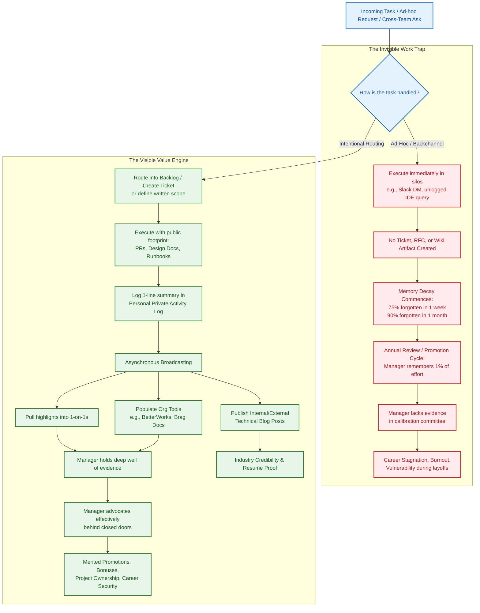

# Don't Do Invisible Work — Chris Albon

---

## Executive Summary & Core Thesis

In his presentation at NormConf, Chris Albon (Director of Machine Learning at the Wikimedia Foundation) delivers a blunt reality check for technical professionals: **If work is not recorded and communicated, it functionally did not happen.** 

The tech industry runs on a pervasive myth of meritocracy—the false belief that "good work speaks for itself" and that diligent managers maintain omnipresent insight into their reports' contributions. In reality, human memory decays rapidly. Performance calibrations, promotion packets, compensation cycles, and layoff evaluations are determined not by the volume of actual effort expended, but by the **surviving memory of that effort**. 

When engineers and data scientists undertake "invisible work"—such as undocumented glue work, ad-hoc analyses for other departments, unlogged mentoring, onboarding support, or refactoring in siloed tools—they set themselves up for career stagnation and burnout. Because neither the individual nor their manager can recall the full scope of contributions months later, managers cannot advocate for them behind closed doors. Making work visible is therefore not selfish self-promotion; it is an operational necessity for engineering health, organizational clarity, and career survival.

### Core Takeaways
1. **Memory Decay Erases Unrecorded Effort:** Over 99% of unrecorded work vanishes from executive and managerial memory within twelve months.
2. **GitHub and Jira Do Not Capture Holism:** Development tools track granular project tickets and code commits; they systematically ignore mentorship, cross-team alignment, operational firefighting, and glue work.
3. **Tracking Must Be Decoupled from Polishing:** To avoid friction and procrastination, maintain a messy, low-friction **Private Activity Log** updated daily, rather than waiting to produce a pristine document.
4. **Arm Your Manager with Ammunition:** Good managers advocate for their reports in rooms where the report is not present; your logs provide the concrete evidence they need to defend your promotion, bonus, or team standing.
5. **Retain Personal Ownership of Records:** Never store your career logs solely inside ephemeral company systems (Slack channels, enterprise wikis); maintain local, portable archives to protect against sudden job loss and to build your ongoing resume.

---

## Key Principles & Actionable Rules

### 1. The Definition of Invisible Work
Invisible work is any high-value effort that leaves no durable, publicly attributable trail in the organization’s recognized systems of record.
* **Why People Do It:**
  * *Altruism & Team-First Culture:* Stepping in to help colleagues, fix broken pipelines, or unblock other teams without formal recognition.
  * *The "Hero" Complex / Feeling Needed:* Deriving immediate dopamine hits from answering ad-hoc Slack questions or running "quick" analyses.
  * *Conflict Avoidance:* Accepting out-of-scope tasks rather than pushing back or forcing the requester to submit a ticket.
  * *The Meritocracy Fallacy:* Believing that exceptional craftsmanship will automatically be noticed and rewarded.
* **Vulnerable Work Types ("Glue Work" & "Blue Work"):** Mentorship, informal data queries, ad-hoc onboarding, internal documentation, operational debugging, and cross-departmental coordination are the most prone to disappearing from institutional memory.

---

### 2. The Manager’s Reality & Evaluation Architecture
Engineers frequently misunderstand how managerial evaluation and promotion committees operate:
* **The Bandwidth Bottleneck:** Managers oversee multiple reports, cross-functional projects, budgets, and executive meetings. They do not know what you do on a day-to-day basis unless you tell them.
* **Closed-Door Advocacy:** Promotion cycles, compensation adjustments, and project allocations happen in closed rooms. If someone challenges your performance or claims you lack cross-team impact, your manager needs immediate, concrete evidence to refute the critique.
* **The "Zero-Memory" Committee:** Promotion committees evaluate dossiers, not vibes. If your contribution cannot be backed up by a date, a business impact, or a deliverable, the committee treats it as non-existent.
* **The Burden of Defense:** Unrecorded work leaves your manager empty-handed. When you fail to track your work, you actively disarm the person tasked with protecting and promoting you.

---

### 3. Strategies to Make Work Visible

#### A. Artifact-Driven Engineering
Ensure every unit of significant effort produces a durable, searchable artifact:
* Convert casual Slack consultations into brief **RFCs, technical design documents, or Confluence/Notion pages**.
* If work happens in a proprietary system or notebook (e.g., Snowflake IDE, Databricks), mirror code or summaries into shared Git repositories or internal wikis.
* Document unscripted mentorship or cross-departmental enablement via written session notes, recorded presentations, or knowledge-base articles.

#### B. The Brag Document (Julia Evans Model)
* A living document where you record major accomplishments, projects shipped, collaborative achievements, and organizational influence.
* Shared periodically with your manager to align on quarterly themes and simplify semi-annual performance reviews.

#### C. The Private Activity Log (Chris Albon Model)
* For engineers who find writing polished prose intimidating or prone to procrastination, keep a **messy, open text file** all day.
* Add 2–3 brief, timestamped lines daily capturing meetings, code reviews, architectural advice, and cross-team assists.
* Use this raw, low-friction record as a searchable source of truth when writing formal performance reviews, brag docs, or 1-on-1 agendas.

```text
2023-10-12 Helped Ads team debug Snowflake schema latency bottleneck
2023-10-12 Participated in cross-functional ML Governance Committee
2023-10-13 Reviewed PR #412 for Kubernetes autoscaling infrastructure
2023-10-13 Mentored junior engineer on writing idiomatic PyTorch pipelines
```

#### D. Multi-Channel Asynchronous Broadcasting
Do not rely on a single channel to communicate accomplishments:
* **Asynchronous Slack Updates:** Post end-of-week summaries in project or team channels.
* **One-on-One Check-ins:** Use your activity log to pull 1–2 highlights into weekly 1-on-1s.
* **Internal & External Blog Posts:** Write technical post-mortems and architecture overviews. These showcase technical authority both internally to senior leadership and externally to future employers.

---

### 4. The Art of Saying "No" and Boundary Enforcement
To prevent unrecorded, non-strategic tasks from derailing your career:
* **Route Every Ask Through a Formal Intake Channel:** When asked in direct messages for "quick help," reply: *"Happy to look at this! Could you drop a quick ticket in our backlog so we can prioritize it alongside our sprint commitments?"*
* **Force Explicit Trade-offs:** If a stakeholder pushes an ad-hoc request, surface the opportunity cost to your manager: *"I can complete this analysis for Marketing today, but it will delay the delivery of the core ML inference engine by two days. Which is higher priority?"*
* **Protect Focus Blocks:** Block out time on your calendar dedicated solely to deep engineering and proactive documentation.

---

## Visual Slide & Conceptual Walkthrough

### Slide 1: Title Card `[00:00 - 00:20]`
* **Visual:** Minimalist purple/white background with NormConf branding.
* **Content:** *"Don't do invisible work"* — Chris Albon, Director of ML, Wikimedia.
* **Context:** Sets the casual, practical tone of the talk, noting that fighting for your work and ensuring you get credit is the most sensible, professional thing an engineer can do.

---

### Slide 2: Speaker Introduction `[00:20 - 00:47]`
* **Visual:** Plain purple slide reading: *"Hi! I work on machine learning at the Wikimedia Foundation. We support Wikipedia."*
* **Context:** Chris highlights his background as an engineering manager and long-time report, acknowledging his own manager (Grant Ingersoll) in the audience chat.

---

### Slides 3–8: The Memory Decay Grid (The 100-Block Visualization) `[00:48 - 02:47]`
Chris uses a 10×10 grid of 100 squares representing the total volume of work completed by an employee at "Acme Software" over a single month.

```
+-----------------------------------------------------------+
| [00:48] TOTAL WORK DONE (100 SQUARES)                     |
| [■][■][■][■][■][■][■][■][■][■]                             |
| [■][■][■][■][■][■][■][■][■][■]  100 units of real effort:  |
| [■][■][■][■][■][■][■][■][■][■]  • Core project tasks      |
| [■][■][■][■][■][■][■][■][■][■]  • Code reviews            |
| [■][■][■][■][■][■][■][■][■][■]  • On-call incident triage |
| [■][■][■][■][■][■][■][■][■][■]  • Architecture design     |
| [■][■][■][■][■][■][■][■][■][■]  • Mentorship & glue work  |
| [■][■][■][■][■][■][■][■][■][■]  • Ad-hoc team support     |
| [■][■][■][■][■][■][■][■][■][■]                             |
| [■][■][■][■][■][■][■][■][■][■]                             |
+-----------------------------------------------------------+
                             ↓
+-----------------------------------------------------------+
| [01:04 - 01:27] THE COMPOSITION OF WORK                   |
| [■][■][■][■][■] (Pink) Big project requested by CEO        |
| [■][■]...[■][■] (Pink) Recurring weekly code maintenance   |
| [■]             (Pink) One-off ad-hoc data analysis        |
+-----------------------------------------------------------+
                             ↓
+-----------------------------------------------------------+
| [01:28] WHAT YOU REMEMBER 1 WEEK LATER (~25 SQUARES)      |
| [■][ ][ ][■][ ][■][■][ ][ ][ ]                             |
| [ ][■][ ][ ][ ][ ][■][ ][■][ ]  75% of your work has       |
| [■][ ][ ][■][■][ ][ ][ ][ ][■]  already faded from your    |
| [ ][ ][■][ ][ ][■][ ][■][ ][ ]  immediate recall.          |
+-----------------------------------------------------------+
                             ↓
+-----------------------------------------------------------+
| [01:52] WHAT YOU REMEMBER 1 MONTH LATER (~10 SQUARES)     |
| [ ][ ][ ][■][ ][ ][ ][ ][■][ ]                             |
| [ ][■][ ][ ][ ][■][ ][ ][ ][ ]  Only major milestones or   |
| [ ][ ][ ][■][ ][ ][ ][■][ ][ ]  memorable fires persist.   |
+-----------------------------------------------------------+
                             ↓
+-----------------------------------------------------------+
| [01:56] WHAT YOUR BOSS REMEMBERS 1 MONTH LATER (~7 SQUARES)|
| [ ][ ][ ][■][ ][ ][ ][ ][ ][ ]                             |
| [ ][■][ ][ ][ ][ ][ ][■][ ][ ]  Your manager only retains  |
| [ ][ ][ ][■][ ][ ][ ][ ][■][ ]  a fraction of what you     |
| [ ][ ][ ][ ][■][ ][ ][ ][ ][ ]  personally recall.         |
+-----------------------------------------------------------+
                             ↓
+-----------------------------------------------------------+
| [02:04] WHAT YOUR BOSS REMEMBERS 1 YEAR LATER (1 SQUARE!) |
| [ ][ ][ ][■][ ][ ][ ][ ][ ][ ]                             |
| [ ][ ][ ][ ][ ][ ][ ][ ][ ][ ]  One single square remains. |
| [ ][ ][ ][ ][ ][ ][ ][ ][ ][ ]  99% of your unlogged work  |
| [ ][ ][ ][ ][ ][ ][ ][ ][ ][ ]  is completely forgotten.   |
+-----------------------------------------------------------+
```

* **Key Takeaway:** At the 1-year mark (when annual performance, compensation, and promotion packets are finalized), **exactly one square remains** in your manager’s memory out of 100 units of completed effort.

---

### Slide 9: The Core Problem Statement `[02:48 - 03:24]`
* **Visual:** Purple text slide:
  > *"The problem is that performance reviews, promotions, bonuses, and other evaluations are based on the work they remember. And if they don't remember, you can be evaluated as if you never did it.*  
  > *And people suck at remembering."*
* **Context:** Emphasizes that your compensation, career safety during layoffs, and advancement rely entirely on fallible human recall.

---

### Slide 10: The Core Solution `[03:25 - 03:54]`
* **Visual:** Slide text: *"The solution is to record your work and tell people about it."*
* **Context:** Simple to understand, yet technically and emotionally difficult to execute consistently.

---

### Slide 11: The Fallacy of GitHub as a Complete Record `[03:55 - 05:19]`
* **Visual:** Bulleted text:
  * *You are the primary beneficiary of recording and talking about your own work.*
  * *GitHub is a tool for tracking the progress of specific types of work, not for tracking the wholistic contributions of individual employees.*
  * *But companies often use it as a heuristic for tracking performance.*
  * *It is on you to keep a record of your work.*
* **Context:** Engineers often rely on Git commit logs, forgetting that glue work, mentoring, architecture debates, vendor evaluations, and IDE queries are never recorded in pull requests.

---

### Slide 12: Work Prone to Invisibility `[05:20 - 06:09]`
* **Visual:** 
  * Examples listed: *Mentorship, Ad-hoc work, Special projects, Communications.*
* **Context:** Refers to Rose Day’s NormConf session on "blue work" (glue work)—often disproportionately carried out by women and underrepresented engineers—which provides massive organizational leverage but lacks automated ticketing visibility.

---

### Slides 13–14: The Implementation Blueprint `[06:10 - 07:09]`
* **Visual:** 
  1. *Build our own lightweight system for tracking our work.*
  2. *Tell our people about that work.*
  * Subtext: *"There are lots of ways to record work. Don't get hung up on how. Just start."*

---

### Slide 15: The Brag Document Model `[07:10 - 08:32]`
* **Visual:** Screen captures of Julia Evans' blog post and brag document templates (`bragdocs.com`).
* **Context:** Explains the polished approach: maintaining a shared document written specifically for managerial consumption.

---

### Slide 16: The Private Activity Log (Chris's Method) `[08:33 - 09:59]`
* **Visual:** A plain text slide showing real excerpts from Chris Albon's personal raw log:
  ```text
  2019-06-04 Helped Branding Team understand how to think about ML
  2019-06-03 Participated on the Human Rights Steering Committee
  2019-06-03 Finished report performance reviews on time
  2019-06-03 Discussed k8s upgrade choices with SRE
  2019-06-02 Gave a presentation at the rest of HR on my approach to promotion packets
  ```
* **Context:** Splitting the workflow into two separate steps (raw daily recording vs. subsequent periodic polishing) prevents friction, self-censorship, and procrastination.

---

### Slide 17: Multi-Channel Communication `[10:00 - 14:39]`
* **Visual:** Bulleted list covering communication methods:
  * *Formal is better than informal. Written is better than verbal.*
  * *Don't discount informal, verbal ways of telling people.*
  * *Blog posts, newsletters even work.*
  * *Keep personal access to them for updating your resume.*
* **Context:** Discusses enterprise performance software (e.g., BetterWorks at Wikimedia), Slack personal DMs vs. external risk, and public technical blogging.

---

### Slide 18: Arming the Manager Behind Closed Doors `[14:40 - 15:52]`
* **Visual:** Large text:
  > *"The goal is if someone ever asks your boss what you did, they have a deep well of concrete examples to choose from."*
* **Context:** The climax of the talk. When your manager enters calibration rooms to fight for your promotion or secure an exclusive project for you, your logged artifacts serve as their ammunition.

---

### Slide 19: Concluding Slide & Live Activity Log Update `[15:53 - 16:27]`
* **Visual:** Slide reading *"Thanks"* with a live-added line:
  `2022-12-15 Gave a presentation at NormConf!`
* **Context:** Chris demonstrates the habit in real time, closing with: *"Probably the most normy thing to do is just to take credit for what we do, because what we do is pretty freaking awesome."*

---

## Chronological Walkthrough & Key Quotes

| Timestamp | Topic & Screen Action | Key Concepts & Spoken Analysis | Standout Quote |
|---|---|---|---|
| **00:00 - 00:50** | Conference intro; title slide; Wikimedia introduction. | Fighting for your work and taking credit is standard, essential professional behavior. Chris introduces his role supporting Wikipedia and jokes about his manager, Grant. | *"The most normy thing ever is to fight for your work, to not do work that people don't see, and to get credit for your work."* `[00:05]` |
| **00:51 - 01:27** | 100-block visualization of monthly effort. | Visualizes the distribution of actual engineering time: flagship projects, recurring maintenance, and ad-hoc side requests. | *"This is a representation of all the work that you as a diligent employee of Acme software did in a month."* `[00:51]` |
| **01:28 - 02:47** | Degradation of memory over 1 week, 1 month, and 1 year. | Highlights the swift erosion of memory. By the end of a year, the manager’s recollection drops to 1 single square out of 100. | *"And this is what your boss remembers a year later... If it's not tracked, it is as if it is invisible work. It means you don't get credit."* `[02:04]` |
| **02:48 - 03:54** | The review dilemma; performance evaluation criteria. | Performance ratings, bonuses, and layoff lists depend strictly on what people remember. Unrecorded work is evaluated as zero. | *"Performance reviews and promotion packets... are based on what people remember you did. And people really suck at remembering."* `[02:50]` |
| **03:55 - 05:19** | Why GitHub is insufficient; external systems and glue work. | GitHub records code artifacts, not individual holistic value. Mentoring, architecture decisions, and off-repo tool work fall through the cracks. | *"GitHub is a tool for tracking the progress of specific types of work, not for tracking the wholistic contributions of individual employees."* `[04:50]` |
| **05:20 - 06:09** | Blue work and glue work vulnerabilities. | Work frequently performed by women and supportive team members—documentation, unblocking others, mentorship—is naturally untracked. | *"You already did the work, you might as well get credit for it."* `[06:05]` |
| **06:10 - 07:09** | The Two-Step Solution. | 1. Build your own lightweight, locally controlled tracking system. 2. Tell people about the work. Avoid over-complicating it. | *"Don't rely on the company's system for tracking your work. Build your own that is hosted locally somewhere that you can control."* `[06:25]` |
| **07:10 - 08:32** | Julia Evans' Brag Documents. | Explains the polished brag document method where the capture format matches the distribution format shared with managers. | *"The thing that you're recording your work in is also the thing that you're actually ending up sharing."* `[08:00]` |
| **08:33 - 09:59** | Chris's Private Activity Log. | Explains why polished writing causes procrastination. Advocates for a simple open text file with messy, single-line daily entries. | *"The idea of writing something polished enough to share with my boss made me procrastinate... So instead, I keep a private activity log where I just write super messy notes."* `[08:50]` |
| **10:00 - 11:59** | Multi-channel communication & formal tools. | Explains the transition from personal logs into formal tools (BetterWorks), 1-on-1 conversations, and weekly status summaries. | *"I have tons of ammunition in my activity log and I'm just hammering them out through every medium possible."* `[11:35]` |
| **12:00 - 13:39** | Public technical blogging and career dividends. | Explains how sharing engineering projects via personal blogs and newsletters secures recognition from hiring managers and recruiters. | *"There's a huge benefit to actually just telling the world that you're doing stuff... Write a blog post about it and put it out into the world."* `[13:00]` |
| **13:40 - 14:39** | Ownership of data & resume building. | Warns against storing career logs exclusively in company Slack channels or corporate wikis. A personal log serves as your resume builder. | *"The brag doc or activity log is a tool for you to build your resume. If you lose your job... all of a sudden you have this huge record of what you've done."* `[14:20]` |
| **14:40 - 15:52** | Managerial advocacy behind closed doors. | Explains how managers use reports' documentation as ammunition when lobbying for high-profile projects, raises, and promotions. | *"If I have that deep well of examples... I can use that as ammo for an argument. And the report doesn't even know that I'm doing this."* `[15:20]` |
| **15:53 - 16:27** | Conclusion and real-time log entry. | Chris updates his own log on screen with his NormConf talk, urging all engineers to embrace taking credit for their efforts. | *"Take credit for what we do, because what we do is pretty freaking awesome."* `[16:11]` |

---

## Mermaid Architecture / Decision Diagram

The following diagram contrasts the career trajectory of undocumented effort (**The Invisible Work Trap**) with systematic tracking and distribution (**The Visible Value Engine**).



---

## Complete Timestamped Transcript

> Spoken audio transcribed and aligned from the lecture recording (`[00:00:00]` – `[00:16:27]`).

**[00:00:00]** don't do invisible work I would actually say that probably the lesson to take away from this is that the most Normy thing ever is to like fight for your work and to not do work that people don't see and to get credit for your work so

**[00:00:16]** we will go through and you'll see a lot of the similar themes so hi I'm I'm Chris I uh don't know how to screen share apparently but I do work at a somewhat popular website um I also am a manager and I've been a manager for a long time and I've also

**[00:00:32]** had managers in fact one of my managers is actually in this slack Grant is in here so if you ever want to know like just like why my life is terrible just point to Grant and then just rag it right now I can't actually see the slack but definitely definitely just point to

**[00:00:48]** Grant so let's do a little visualization this is a representation of all the work that you as a diligent employee of Acme software did in a month let's say this was like some big project

**[00:01:07]** that the CEO wanted you to do right and so it took five you know units of whatever this is this recurring work that you do every week where you you know standardize code or debug something or something and then here is you know one ad hoc

**[00:01:23]** thing off to the side because someone from some Department you've never heard of before comes to you and wants some kind of analysis the problem is that if you don't consciously spend the time to track your work this is what you actually remember

**[00:01:39]** what you did and like a week later and then everyone knows this feeling right it is so hard to write about what you did the week before if you wait until Monday um if we keep going with the same pattern this is what you remember

**[00:01:54]** a month later and if you go even farther take one step away this is what your boss remembers all the things you did right for the for a month later this is what your boss remembers a year later and everything else in there if it's not

**[00:02:11]** tracked in some way like if there's not a way to jog your memory that you did it and very specifically to jog your boss's memory that you did it it is as if it is invisible work right it is it it means that you don't get credit for doing those things even though as we've

**[00:02:27]** established if we go back like you did all this super cool stuff right you worked on this big project you did this recurring debugging thing you talked to this like special person off to the side and help them out with the project and yet you don't get any credit for it from

**[00:02:39]** your boss if no one remembers that it happens and the thing that I would like to point out and the thing that I hope you take away with from this presentation is that it happens all the time all the time in Tech all over the place

**[00:02:54]** and the fundamental problem is that performance reviews and promotion packets and whether or not you get a bonus or whether or not you get targeted for a layoff or whether or not you can do anything is based on what people remember you did people ask in your boss

**[00:03:09]** your skip other peers and yourself right if no one remembers that something happened it's as if you don't get credit for it and the problem is that without tools people really suck at remembering what people do

**[00:03:25]** the solution is both simple and frustratingly difficult it's to record your work and to tell people about it and this really parallels very closely the stuff that Rose was talking about right figure out what matters record whether you're

**[00:03:41]** doing it and then tell people that you're doing it and that is like a very the reason I wanted to do this talk for this one is it's a very very like Norm comfy idea it's just like record what you're doing and tell people about it [Music]

**[00:03:55]** and the thing is that no one is going to do this for you and and each some of you some of you would be probably screaming at your screen right now because you're thinking well I do all my work in you know GitHub right like so therefore I could just look back in GitHub and see

**[00:04:10]** every single thing I do the problem is that a lot of the work you end up doing is actually valuable but outside of GitHub so say if you work in some kind of proprietary system off to the side say you you know work in like I don't know like say snowflakes

**[00:04:25]** IDE or something like that it might not appear in GitHub say you end up like actually mentoring someone so like someone wants to be a data scientist from the ads Department you've spent a few lunches helping them out or something like that you can actually end

**[00:04:38]** up in a situation where you aren't getting credit for that work because it doesn't appear in your regular tracking thing and the problem is that because you're the primary beneficiary of this and because GitHub is more about Pro like

**[00:04:53]** tracking work as if like with the goal of completing that work for some kind of project you're not tracking your your contribution as a whole a lot of this stuff can fall by the wayside and it means that the one of the best things you can do

**[00:05:09]** for yourself really like just genuinely one of the best things you can do for yourself is just record what you do and tell people about it the other thing that comes up is that some work is just more susceptible to being invisible

**[00:05:24]** um Rose brought up blue work which is a very classic example of the type of work type work that's very often done by women in tech companies that is things that just don't appear in in many other places right it would be things like mentorship or talking to customers or

**[00:05:40]** you know expanding documentation or some kind of like one-off project or things like communication that it's just it's easy for that to Fall by the wayside because it's not naturally tracked in any kind of like Asana or or GitHub or something like that and so if you do

**[00:05:55]** some kind of like ad hoc mentorship with someone and no one ever brings it up again again it's as if it's invisible work it's as if you didn't do it you're not going to get credit for it for any kind of promotion and that's wrong like you should you should fight and get

**[00:06:08]** credit for it you already did the work you might as well get credit for it so what can we do it's a very uh complex two-step process I I sort of Joker but it's actually like it's actually really difficult to do and I'll I'll talk to like you know what some of the ways to

**[00:06:22]** get around it is um one builds a really lightweight system for tracking your own work and your own lightweight system don't like rely on like the company system for tracking your work like build your own that is hosted locally somewhere that

**[00:06:34]** you can control and then two tell people about your work there's various ways that you can end up doing that there are lots of ways to end up recording work and I don't I in design this talk I I didn't want to focus too

**[00:06:48]** much on like specific ways like rose brought up with like the way that she ends up using um there's lots of there's lots of different ways I'll talk about a few of them I'll talk about my own one but whatever works for you is fine right the

**[00:07:00]** only real requirements to this thing is that you like record what you do and then be able to like use that and it'll to communicate back to people ragdocs Julie Evans I I think she came up with it and I I want to give her credit for it because I I think she

**[00:07:15]** invented it but I don't wanna like if there was if it actually came out from somewhere else I don't want to like jump on um jump on their credit but that was the first time I I read about it was Julie Evans Works um blog post and the idea behind of a

**[00:07:30]** brag document is actually super powerful so you create this document that inside that document you write really polished notes about you know like things that you've accomplished right and so like you you know accomplish some projects

**[00:07:45]** you Mentor some people whatever it is and you write those little nuggets like in the document itself and then you share those document that exact document with your um with your boss or with your skip or something like that and the thing that's

**[00:07:59]** right that that is very appealing about that approach is that the thing that you're recording your work in is also the thing that you're actually ending up sharing so your communication pathway using the doc is actually the exact same as the

**[00:08:14]** um way that you're recording it there's tons of resources out there on ragdocs uh Julia has a template there's also you can literally go to ragdocs.com I think and there's actually like a template there like there's tons of really cool things out there there's

**[00:08:28]** lots of brag doc templates on on GitHub um it's a it's a great approach what I do because I was never able to actually successfully accomplish a true practice I keep a private activity log so instead of having a document

**[00:08:47]** where I would write what I accomplished and you know like for some kind of project I was always like the idea of writing something in a in a way that was polished enough to share it to my boss always kind of made it that I ended up procrastinating actually writing down

**[00:09:01]** that I did the thing and then I would forget so it was just like vicious cycle so instead I kind of split them up where I have um a private activity log where I just write super messy notes on what I did that is sort of the like really you know

**[00:09:15]** super messy one-line kind of notes mostly just to jog my memory later on that I did something uh the example on the second half of the slide is a real example of my activity log I've changed like some dates and blah

**[00:09:30]** blah but like basically this is what it looks like it's just hundreds of lines like this and I'm adding lines you know I'm adding like two or three lines like a day every single day um just dumping them in and I don't think all those lines would really like

**[00:09:43]** reach the level of brackiness I don't know what to put really like like reach that level of of you know wanting to like show that to people but I'm just I'm just like dumping anything that I think might be useful for um for the you know for the future that I

**[00:09:57]** can use it then the second part which is that there's lots of ways to tell people about your work and I I think the thing that was difficult for me with the brag doc was that a lot of

**[00:10:15]** times like the way that organizations communicate their performance and communicate like the work that you did is often like like weirdly formal so um at the Wikimedia Foundation like in Grants Grant was my boss at the

**[00:10:30]** Community Foundation we'd have like a separate thing like every every quarter I would like paste what I did into uh betterworks.com that was where I paced it and so like it didn't really work with the brag document format because I would have to like take it out and put

**[00:10:45]** it into this like separate third-party SAS platform to to show my work um and so you know I to me I think like of course like using the internal internal places of reporting work like we used better work so I would put it into better Works

**[00:11:02]** um written is way better than than doing it verbally um because you remember things longer if it's written and you can refer it back to them but I don't think you should like discount the just informal like bringing up that you did something right

**[00:11:16]** like if you're having like a casual one-on-one with your manager glance to your doc and make sure you say some of the things that you think might be interesting right like just like it it it's I wouldn't like formalize everything to the point where like the

**[00:11:29]** only way that you're talking about your work is through like this one document I would just be like I have tons of ammunition in my activity log and I'm just like hammering them out through every medium possible I'm talking about it on slack I'm writing a weekly you

**[00:11:42]** know update to the whole staff where I'm putting things in there I'm talking about it in weekly one-on-ones verbally I'm putting it into like a one-on-one note doc if I have like whatever whatever I can I'm like pushing it out there that I'm doing this kind of stuff

**[00:11:55]** um the one the one that's kind of like incredibly impressive and I think I would like to do more of is blog posts and newsletters so I had there was this person who worked at slack and I I won't I won't name her

**[00:12:10]** um but she was really accomplished this like an amazing person and one of the things that she has she talked about sort of in like a like a private meeting um was that like by putting stuff out there in in blog posts and newsletters

**[00:12:25]** you know like here's this cool project we did here's all the work I did on it and that kind of stuff like a project on your like or on a blog post on your personal blog you are in a way communicating it in a way that you can then refer to later and so like even

**[00:12:37]** things like writing stuff for for this audience um is actually a way for you to communicate out that you're doing stuff which is just super valuable and it you know we talk about things like grad documents or activity

**[00:12:52]** log um in terms of like promotion for your current job so think about in terms of job security but there's a huge benefit to actually just telling the world that you're doing stuff like if you're doing some super cool I don't know like some

**[00:13:06]** super cool new kubernetes thing or something like that like you know like record that stuff in your activity log write a blog post about it and put it out into the world and like you get you will get credit for that in ways that are really interesting you'll

**[00:13:20]** get you know someone when you're applying for a job someone will look at your personal site see the kind of stuff that you're doing think it's super interesting and then you'll sort of Advance the next round or something like that and it's just it's really useful

**[00:13:31]** but you're not going to be able to do that if you're not sort of recording for yourself like what you do the other one is that you should definitely keep personal access to the things don't just rely on the internal customer company systems I say that

**[00:13:46]** because honestly like no joke the best place to put like your activity log or what you're doing like the most easiest place and it's wonderful is if your company uses slack just use your like use your own slack Channel like direct message yourself on slack that's like

**[00:14:03]** it's time stamped it's awesome it's amazing but if you lose access to slack you're going to lose access to all that information so like I don't use that even though it's so nice and easy and simple to use

**[00:14:15]** um but you really do want to make sure that like whatever happens right you can do it and I actually messaged in the in our slack for this conference that like the brag dock or activity log or whatever you want to do is a tool for you to build your resume

**[00:14:30]** like if you lose your job and you need to like update your resume all of a sudden you have you know this huge record of what you've done and you can sift through it and find some really interesting stuff the goal for this whole thing

**[00:14:44]** is if someone asks your boss or like someone asks a recruiter or something like what have you done they have that deep well of of examples to choose from and actually you know Rose brought up this like really great point that I think people overlook

**[00:14:59]** that as a manager I know that there are times that I'm advocating for a staff member or like one of my reports and that the report doesn't know that right there's some like special project that's coming up and I want them to be

**[00:15:14]** the one doing it and someone you know someone's like oh I don't know if they're the right person and like if I have that you know like if I can dig through those notes and those brag docs for them or whatever they have listed like I can bring up all these great

**[00:15:26]** examples if I remember all those great examples if I can look through their you know like formal like you know letters that they're right like like weekly updates or whatever that they're writing I can use that as ammo for like an argument and their actual report who

**[00:15:38]** wrote them like doesn't even know that I'm doing this right but like it's important it's important and if you have a good manager that manager is advocating for you and it's great to give them that kind of ammunition that they can use even though if you end up

**[00:15:50]** not seeing it um in any you know like you don't actually know that they're doing it at the moment that is the end of my talk um and here's my little I'm gonna add this to my own activity log gave a presentation at Norm conf

**[00:16:06]** um because you know we should all we should all track our work and I definitely think probably the most normally thing to do is just to take credit for for what we do um because what we do is pretty pretty freaking awesome
